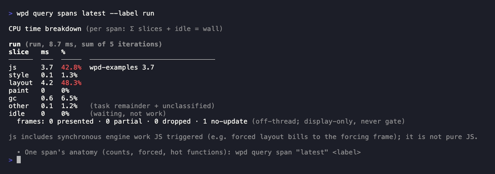
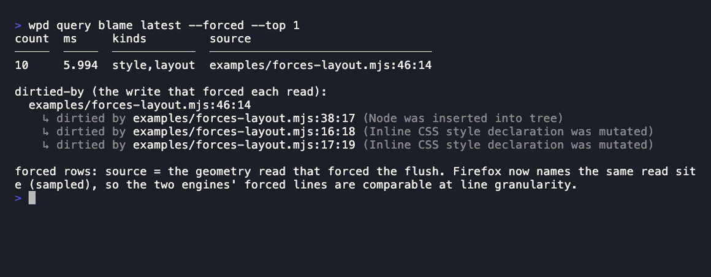
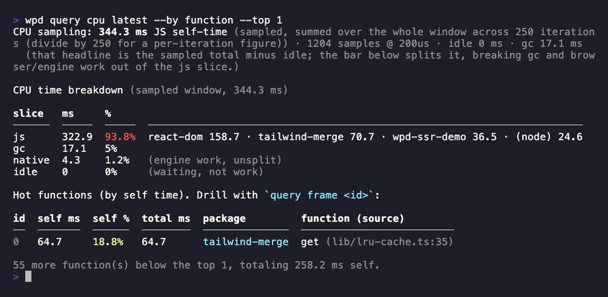
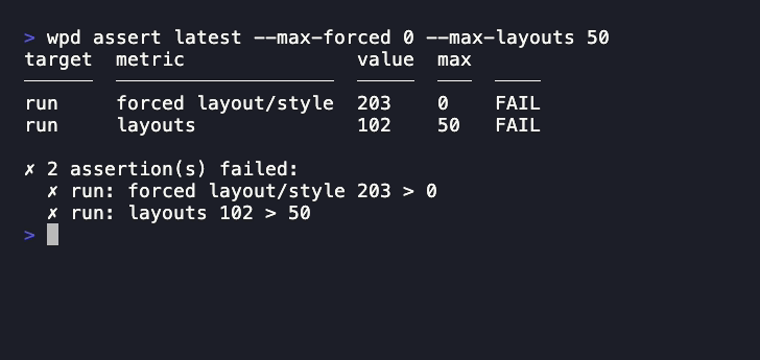

# @jantimon/web-performance-debugger

[](https://www.npmjs.com/package/@jantimon/web-performance-debugger)
[](https://github.com/jantimon/web-performance-debugger/actions/workflows/ci.yml)
[](https://www.npmjs.com/package/@jantimon/web-performance-debugger)
[](https://github.com/jantimon/web-performance-debugger/blob/main/LICENSE)

<p align="center">
  
</p>

Account for **every millisecond** of an interaction, and make it add up. `wpd` drives real Chrome or
Firefox (or pure Node) and decomposes one measured span into slices that tile it exactly:

```
run (run, 10.2 ms, sum of 5 iterations)
slice   ms   %
──────  ───  ─────  ───────────────────────────────
js      2.8  27.1%  wpd-examples 2.1 · (native) 0.7
style   4.4  42.9%
layout  2.4  23.3%
paint   0    0%
gc      0    0%
other   0.7  6.7%   (task remainder + unclassified)
idle    0    0%     (waiting, not work)
```

`Σ slices + idle = wall`, exactly. No unexplained time: JS is split by owning package, style and
layout carry real milliseconds, and the part that was just waiting for the next frame is `idle`, not
a vague "browser" bucket that reads like work. Above is a real forced-layout probe, so style + layout
dominate; on a typical interaction most of the wall is `idle` (the frame wait) and `wpd` says so.

The same tool attributes rendering and JS cost back to the **source line** that caused it, runs
headless, and gates in CI. Run it with `npx @jantimon/web-performance-debugger ...`, or install it and
use the short `wpd`.

## Start from your symptom

Match what you are seeing to a starting command, run it against your own code, and read the result.
Every command below runs against a committed example, so each shot reproduces from a clean checkout;
each block links to its full section.

### An operation is slow and you can't see where the time went

The reconciling bar tiles any measured span (the `run` window, a driver step, or a
`performance.measure`) into `js · style · layout · paint · gc · other · idle` that sum to the wall
exactly, so no millisecond hides in a vague "browser" bucket.

```bash
wpd record examples/measure-span.mjs --bench --breakdown --iterations 5
wpd query spans latest --label run
```



Full section: [Where did this interaction's time go](#where-did-this-interactions-time-go).

### A line forces synchronous layout

Reading geometry (`offsetTop`, `getBoundingClientRect`, ...) right after a DOM write forces a
synchronous layout flush (a forced reflow). `--deep` names the read that forced the flush and the writes that dirtied it.

```bash
wpd record examples/forces-layout.mjs --bench --deep --iterations 5
wpd query blame latest --forced
```



Full section: [A line forces synchronous layout](#a-line-forces-synchronous-layout).

### SSR or a hot JS loop is slow

`--target node` profiles pure JS with no browser at all, attributing self-time to the source line,
file, and owning package. That is where SSR runs in production.

```bash
wpd record examples/ssr-demo/demo.mjs --target node --iterations 250
wpd query cpu latest
```



Full section: [SSR or a hot JS loop is slow](#ssr-or-a-hot-js-loop-is-slow).

### One dependency dominates your CPU time

The same CPU model, rolled up by package instead of by function. The bar above already names the
split, and `--by package` ranks it.

```bash
wpd query cpu latest --by package
```

Full section: [SSR or a hot JS loop is slow](#ssr-or-a-hot-js-loop-is-slow).

### A change might have regressed a budget

`assert` fails the build when a budget is blown; `diff` and `cpu-diff` compare two recordings.

```bash
wpd assert latest --max-forced 0 --max-layouts 50
```



Full section: [Did my change regress a budget](#did-my-change-regress-a-budget).

## 30-second quickstart

The fastest start needs no file at all: point `wpd` at a URL your dev/preview server is already
serving, and it profiles the page's own boot (navigate, then settle) as one `load` step.

```bash
# zero authoring: the built-in load flow, then read the boot's breakdown
npx @jantimon/web-performance-debugger record --url http://localhost:5173 --breakdown
npx @jantimon/web-performance-debugger query spans latest
```

`--url` names the host page — a live URL or a local HTML file path — and wpd tells the two apart.
(The `--html` spelling still works as a hidden alias, and a host with no scheme like `localhost:5173`
gets `http://` assumed.)

Default gives the boot's four-slice CPU bar; `--breakdown` adds the reconciling
js/style/layout/paint bar and exact counts; `--deep` adds forced-layout blame. A page load has no
interaction, so `INP` stays null there — to measure a click, a re-render, or SSR, you write a small
`run` function (the contract: [Your `run` module](#your-run-module)) and pick the lane by what you
are measuring:

- **A real user flow in a real app** → the default **driver** lane: `run` gets a Puppeteer `page`
  and drives your `--url`.
- **An isolated DOM-touching snippet** → `--bench`: `run` executes inside the page, repeated with
  `--iterations`.
- **Pure JS, no DOM (SSR, hot loops)** → `--target node`: no browser at all.

```bash
# 1. the reconciling bar for a forced-layout probe, in-page:
npx @jantimon/web-performance-debugger record probe.mjs --bench --breakdown --iterations 5
npx @jantimon/web-performance-debugger query spans latest

# 2. who forced the layout (source lines), plus the thrash count:
npx @jantimon/web-performance-debugger record probe.mjs --bench --deep --iterations 5
npx @jantimon/web-performance-debugger query blame latest --forced

# 3. pure-JS cost, no browser:
npx @jantimon/web-performance-debugger record render.entry.js --target node --iterations 50
npx @jantimon/web-performance-debugger query cpu latest
```

Each `record` runs your flow **once** (one browser launch, one pass) and writes into `./recordings/`
(or name the run with `--out`): one small **recording** (`<timestamp>.json`) holding the run summary
and every span, a resolved CPU model (`.cpu.json`) plus the raw `.cpuprofile`, and — only under
`--deep` or Firefox — the classified event log inside the recording. A `latest` pointer tracks the
newest run, so every `query` verb accepts `latest` instead of a file path.

## Requirements

- **Node 24+**.
- **Chrome** is downloaded automatically by Puppeteer on install. To skip the browser entirely, use
  the `--target node` lane (CPU profiling only, no DOM/layout/paint).
- **pnpm users:** pnpm 10+ blocks Puppeteer's browser-download postinstall by default, and pnpm 11
  hard-fails `pnpm exec wpd` on that gate. Pick one recipe in your `package.json`: allow the download
  with `"pnpm": {"onlyBuiltDependencies": ["puppeteer"]}`, or suppress the build-script gate with
  `"pnpm": {"ignoredBuiltDependencies": ["puppeteer"]}` — but the latter only silences the gate, it
  does not download a browser, so you must supply one yourself (set `PUPPETEER_EXECUTABLE_PATH`, or
  populate the puppeteer cache with `npx puppeteer browsers install chrome`).
- **Firefox** is optional (`--target firefox`): install it once with
  `npx puppeteer browsers install firefox`. See [What each target gives you](#what-each-target-gives-you).
- When `--url` is a URL, **your dev/preview server must already be running** at that URL; wpd does
  not start it.
- A `--url` local HTML file, and `--bench` modules, must live **under the current working directory**
  (they are served to the browser from there). Driver and `--target node` modules are imported in Node
  and can live anywhere.
- **Chrome launches sandboxed.** Some environments (containers, restricted CI) cannot start Chrome's
  sandbox; there wpd fails with a message naming the opt-in, `--disable-browser-sandbox`, rather than
  silently dropping the sandbox. Only pass it in a trusted, isolated environment (and never together
  with `--user-data-dir` or a non-loopback `--url`).

## Your `run` module

`record <module>` takes a plain JS file and imports it as an ESM module (`.mjs`, or `.js` in a
`"type": "module"` package). It is not a script that runs top-to-bottom: wpd calls the hooks it
exports, so only `run` is measured. It can export up to three hooks:

```js
export async function prepare(arg) {} // optional, before the measured window (alias: setup)
export async function run(arg) {}     // the measured part
export async function cleanup(arg) {} // optional, after the window (alias: teardown)
```

`prepare` and `cleanup` run **outside** the measured window, so setup and teardown never pollute the
numbers: once around all `--iterations`. All three hooks receive the same argument, which depends on
the lane. Note the asymmetry: in driver mode `ctx` is a *property* of the argument; in the other lanes
it *is* the argument.

- **driver** (default): `run({ page, ctx, measureStep })` executes in Node, `page` is a Puppeteer page.
- **`--bench`**: `run(ctx)` executes inside the browser page, with live `document`/`window`.
- **`--target node`**: `run(ctx)` executes in this Node process.

`ctx` starts as an empty object and is shared across the hooks: stash things in `prepare` (a handle, a
prebuilt DOM node, test data) and read them in `run`. `--iterations` / `--warmup` (defaults 1 / 0)
repeat `run` in **every** lane. In driver mode each iteration re-measures every step, so a step reports
the **median** of its samples instead of a single reading — see
[Measuring an interaction more than once](#measuring-an-interaction-more-than-once).

In `--bench` the module is imported *inside the page*, so it must live under the current working
directory to be servable. It also runs in the browser, so it has **no `process.env`**: route
parameters in through the URL/query string (`--url`) or page globals, not env vars. Driver and
`--target node` modules are imported in Node and can live anywhere.

Match `--iterations` to the phase you are measuring. A phase that can only happen once per page (a
first mount) runs with `--iterations 1` — that is one sample; repeat it by running `record` again. A
phase you can repeat in place (an INP-style re-render, a cache probe) iterates in-page, and each
`--iterations` pass is a fresh sample of the same work.

## One capture per run: the capture modes

Every `record` invocation is **exactly one capture pass** — one browser launch, one run of the flow.
A capture mode picks *what* that pass captures. They are mutually exclusive: each answers a different question
with a different instrumentation, and wanting two answers means running `wpd` twice.

| Capture mode (chrome) | What it captures | What you get | Speed |
| --- | --- | --- | --- |
| **no measurement** *(not a mode)* | nothing — plain browser, no trace, no sampler | just the wall; the baseline the Speed column is measured against | 🏆 baseline |
| **default** (no flag) | CPU sampler only, no trace | the four-slice CPU bar (`js · browser · gc · idle`), cleanest wall. No rendering counts | 🐌 Δ ~4-7% |
| **`--breakdown`** | light trace + CPU sampler, fused | the reconciling **seven-slice bar** per span (`js·style·layout·paint·gc·other·idle`, `Σ + idle = wall`) plus exact layout/style/paint counts | 🐌🐌 Δ ~25% |
| **`--deep`** | full trace (`.stack` + invalidations), sampler off | the **attribution report**: forced-by read-sites, dirtied-by writes, the thrash detector, invalidation rollup, exact counts, long tasks. Identities and counts, no slice ms | 🐌🐌🐌 Δ ~70% |
| **`--precise-wall`** | sampler off, no trace | a pristine benchmark wall (buys back the sampler cost). Nothing else | 🏆 Δ ~0% |

**Speed** is the median wall-time overhead each mode adds over the no-measurement baseline, on a
mid-size mixed JS + layout workload, from the repo's own probe (`examples/capture-mode-speed.mjs`).
It is directional and machine-dependent: the ordering holds, the exact percentages will not. The
trace-based modes (`--breakdown`, `--deep`) cost more the more the page renders, because the trace
records every layout/style event, so a heavier interaction pays more than these numbers and a lighter
one less.

The split is what keeps the numbers honest. The CPU sampler must never ride a `.stack` trace (it
inflates sampled self-time +21%, billing the trace's own stack-walk to the JS frame that forced a
layout), so `--breakdown` samples only the light no-`.stack` trace and `--deep` runs the sampler off.
For the same reason `--deep` suppresses slice durations: the `.stack` trace inflates style recalc up
to +38%, and a distorted millisecond is worse than none — so `--deep` leads with identities and exact
counts, and shows span wall (the honest window width) but no slice ms.

**Want the bar and the blame?** Run twice: `record --breakdown` for the reconciling bar and CPU model,
`record --deep` for the forced-by/dirtied-by/thrash attribution.

`--target firefox` is one Gecko-profiler pass in every capture mode (samples and markers are entangled at
profiler startup), so the capture modes are reporting tiers over that one capture rather than capture tiers;
`--breakdown`/`--precise-wall` are rejected there and `--deep` adds a dirtied-by write report. That pass has
no sampler-free counterpart — the Gecko profiler is a startup feature for the whole browser lifetime — so
even Firefox's fastest capture pays for it: **🐌🐌🐌 Δ ~150%** over a plain Firefox launch on the same
workload, and `--deep` is the same capture at the same cost. Chrome can buy the sampler back with
`--precise-wall`; Firefox cannot, so its numbers are a floor, not a benchmark wall.
`--target node` is a CPU-only lane with the four-slice bar. See [the lanes](#what-each-target-gives-you).

## Where did this interaction's time go

`--breakdown` fuses a light trace with the CPU sampler into one pass and tiles each span into the
seven-slice reconciling bar. `--bench` runs a module's `run()` inside the page, so you can reproduce
the work in isolation:

```js
// probe.mjs
export function run() {
  const el = document.body.appendChild(document.createElement("div"));
  for (let i = 0; i < 100; i++) {
    el.style.width = i + "px"; // write
    void el.offsetWidth;       // read -> forced layout
  }
}
```

```bash
wpd record probe.mjs --bench --breakdown --iterations 5

wpd query spans latest
```

```
CPU time breakdown (per span: Σ slices + idle = wall)

run (run, 10.2 ms, sum of 5 iterations)
slice   ms   %
──────  ───  ─────  ───────────────────────────────
js      2.8  27.1%  wpd-examples 2.1 · (native) 0.7
style   4.4  42.9%
layout  2.4  23.3%
paint   0    0%
gc      0    0%
other   0.7  6.7%   (task remainder + unclassified)
idle    0    0%     (waiting, not work)
```

Style + layout are 66% of this span: the read-after-write loop is paying for a synchronous flush on
every iteration. `idle` is 0 because a tight loop never yields to the frame; on a real interaction
`idle` is usually the largest slice (the wait for the next paint), and naming it as idle rather than
folding it into work is the whole point. Every slice is disjoint main-thread self-time from the trace,
so the sum is exact by construction, not a proportional allocation.

`--breakdown` also reports **exact counts** (layout/style/paint), main-thread windowed:

```
metric        count  ms
────────────  ─────  ────
layout        102    2.4
style recalc  103    4.39
paint         3      0.21
```

The counts are trace-derived and exact; the milliseconds are wall-tier (~1%, directional). It cannot
report forced-layout counts or blame — those need the `.stack` trace category, which `--deep` captures
(see below).

## A line forces synchronous layout

Reading geometry (`offsetTop`, `getBoundingClientRect`, ...) right after a DOM write forces a
synchronous layout flush (a forced reflow). `--deep` captures the full trace (`.stack` + invalidation tracking) with the
sampler off, and reports who read, who wrote, and whether the two interleaved into thrashing:

```bash
wpd record probe.mjs --bench --deep --iterations 5

wpd query blame latest --forced
```

```
count  ms     kinds         source
─────  ─────  ────────────  ──────────────
1000   9.97   style,layout  probe.mjs:6:13
```

Line 6, `void el.offsetWidth`, caught red-handed: 100 loop reads forcing style + layout, times 5
iterations. `blame --all` lists every attributed line with a `forced` column, so "ran but never
forced" is a real answer too, not a guess.

`record --deep` also prints the layout-thrashing interleave when it finds one: the write→read→write→read
signature where each geometry read re-flushes a layout the prior write dirtied.

```
⚠ layout thrashed 202x during this run  (a write re-dirtied a just-read layout; forced re-flush)
  interleave (write → read), the thrashing signature:
    write forces-layout.mjs:16:18 (Inline CSS style declaration was mutated) → read forces-layout.mjs:52:14 (style)
    read forces-layout.mjs:52:14 (layout)
    …
```

`query span run <recording>` shows the same anatomy scoped to the run window (counts, forced read-sites
with their dirtied-by writes, and the thrash rollup); `query blame --forced` lists the read-sites, and
under each the write that dirtied it (chrome `--deep` names both ends).

## A page janks on a real interaction

By default `record` drives the page through Puppeteer: your `run` receives `{ page, ctx, measureStep }`,
and each `measureStep` becomes one **step span** — counts plus INP (Interaction to Next Paint, the
time from the interaction until the next frame reaches the screen). Add `--breakdown` for the
reconciling bar per step.

```js
// flow.mjs
export async function run({ page, measureStep }) {
  await measureStep("open menu", () => page.click("#menu"));
  await measureStep("type query", () => page.type("#search", "shoes"), {
    until: "#results", // selector, async fn, or promise; omit for a rAF+idle settle
  });
}
```

```bash
wpd record flow.mjs --url http://localhost:3000 --breakdown

wpd query spans latest
```

```
first increment (step, 39.1 ms)
slice   ms    %
──────  ────  ─────  ───────────────────────────────
js      2     5.1%   react-dom 2
style   0.1   0.2%
layout  0.1   0.2%
paint   0.1   0.2%
gc      0     0%
other   17.7  45.4%  (task remainder + unclassified)
idle    19.1  48.9%  (waiting, not work)
```

Half of this step is `idle` — the frame wait — and only 2 ms is JS. That is the point of the bar: it
stops you optimizing a re-render that was never the cost. `record` also prints the Core Web Vitals
split of the interaction:

```
Where that interaction's time went (in-page, Core Web Vitals split)

input delay         1 ms    (main thread busy at input)
processing          1.2 ms  (your event handlers)
presentation delay  21.8 ms (rendering the result)
```

That is the standard triage: a slow interaction is slow because the main thread was busy when the
input landed, because your handler ran long, or because rendering the result did. A `—` means no
interaction crossed the 16 ms floor the Event Timing spec sets, so nothing was measured.

A step also carries any **Long Animation Frames** it triggered (Chrome), naming the scripts that made
a frame slow — the listener/callback, its script url, its duration, and the ms it spent in forced
style/layout. This attributes a step's cost to source even in the default capture mode (no trace, no CPU
sampler window): `query span <step>` prints the blamed scripts under the interaction split. It is
Chrome-only today; a Firefox step omits it rather than reporting a fake zero.

`inp ms` and the CWV split are measured **in-page**, so they describe the page, not the driver. A
step's `wallMs` is the page's own window too: the trace-clock span between the step's marks under
`--breakdown`/`--deep`, or the page's `performance.now` delta in the default capture mode — never the node-side
`page.click` bound (~20 ms of which is input dispatch in the tool's process, in no renderer timeline).
The stored span records which clock priced it in `wallClock` (`"trace"` or `"page"`).

Omitting `until` waits for the page to **settle**: two animation frames, each followed by an idle
callback, which covers the usual state-update → render → cleanup pattern. Pass `until` when your step
ends on something specific: a selector to wait for, or a function or promise that wpd awaits. The
settle floor is two frames — ~16 ms on the default headless mode (chrome-headless-shell, ~120 Hz) and
~31 ms under `--headless-mode new` (full Chrome, ~60 Hz). `wall`/`INP` carry this one-frame floor, so a
sub-frame re-render reads as the frame time; read the counts, the bar, or `interaction.processingMs`
for the work itself. See [docs/dev/frame-floor.md](docs/dev/frame-floor.md).

**Streamed / soft navigations.** The default settle resolves the moment the page goes briefly idle,
which on a streamed SPA route change (markup arriving in chunks) can be *before* the content lands.
For a navigation-like step, wait on the landed content — or use the exported `waitForStable`, which
waits for a selector and then for the DOM to stop mutating:

```js
import { waitForStable } from "@jantimon/web-performance-debugger";

await measureStep("open product", () => page.click(".product-link"), {
  until: waitForStable(page, { selector: "#add-to-cart", quietMs: 200 }),
});
```

It is opt-in, not the default: it trades a longer, more variable wall (the `quietMs` tail rides on
every step) for catching the whole transition.

**Clicking a page that never stops re-rendering.** Prefer a stable selector and `page.click('#id')`.
A raw element handle (`evaluateHandle(...).asElement().click()`) throws `Node is detached from
document` when the app re-renders between grabbing the node and clicking it, and
`page.locator(sel).click()` can hang on its actionability wait when the page never settles.
`page.click` on a stable id sidesteps both. It is also the click to reach for because it is **trusted**:
it produces an INP entry, where a synthetic `page.evaluate(() => element.click())` produces none at all
(no Event Timing entry, so `inpMs` stays `null`).

**Behind a login?** Add `--no-headless` to sign in by hand and `--user-data-dir ./.wpd-profile` to
persist that session. Gate the login in your driver so it only waits when not yet authenticated, and do
any iframe/list waiting there too.

### Measuring an interaction more than once

One reading of `wall ms` cannot tell a regression from noise: it is a single sample of a clock Chrome
deliberately clamps. `--iterations N` repeats `run` and re-measures every step, so each one reports the
**median** of its samples, with `--warmup M` for untimed runs first:

```bash
wpd record flow.mjs --url http://localhost:3000 --iterations 20 --warmup 3
```

Each step keeps its **raw samples** in the recording (`spans[].perIteration`), because a median hides
the bimodality that usually is the finding — a median of 40 ms next to a max of 255 ms says one
iteration was cold. `spans[].stats` is that step's own min/median/mean/max, `null` below 2 samples.
There is deliberately no median *across* steps: "mount" and "inp" measure different work, so pooling
them would produce a real-looking number that means nothing.

Each iteration must measure the **same steps** — `wpd` fails the run rather than report a median over
fewer samples than it claims. On a flaky production site where one slow iteration can time out, add
`--keep-partial`: if a **later** iteration fails, `wpd` keeps the iterations that completed and writes
the recording with a loud note naming the failed iteration and the step it died on (`meta.iterations`
is the completed count, not the requested one). A failure in the **first** iteration still errors —
there is nothing honest to salvage from a flow that never completed once.

If a step needs a fresh page every time, put a bare `page.goto(url)` in
`run` outside any `measureStep`: everything after it is fresh each iteration, everything not preceded by
one repeats in place. Make a `page.goto` its own step to measure a **cold boot** (drop `--url` so the
page starts blank; everything from navigation through first render lands in that step).

**Counts do not scale with `--iterations`.** A step's counts describe its first timed iteration, so an
`assert --max-layouts` gate on a step keeps its meaning. The *run* span's counts are a total across
iterations (its window covers the whole loop); `meta.notes` says so, and `query spans` labels the run
span `sum` and a step span `first` (see [aggregation](#what-a-spans-numbers-represent)).

## SSR or a hot JS loop is slow

When the cost is JavaScript, profile self-time per function and per package. `--target node` runs
`run()` in this Node process (no browser, no DOM): that is where SSR runs in production, and it resolves
`node_modules` directly without bundling to a browser module.

```js
// render.entry.js
import { renderToString } from "react-dom/server";
import { createElement } from "react";
import Page from "./your-compiled-output.js";

export function run() {
  for (let i = 0; i < 50; i++)
    renderToString(createElement(Page));
}
```

In a real app, `./your-compiled-output.js` is your component compiled to plain JS (node can't import
JSX/TS directly). Any bundler works; the requirements are plain ESM output, a sourcemap (for line
attribution), and dependencies kept **external**, so node resolves `react-dom` & co from `node_modules`
and wpd attributes them per package (a bundled-in dependency gets blamed on your app bucket instead).
With esbuild:

```bash
esbuild src/pages/Product.tsx --bundle --packages=external --platform=node \
  --format=esm --sourcemap --outfile=your-compiled-output.js
```

```bash
wpd record render.entry.js --target node --iterations 50
```

The `record` report leads with the CPU headline and the by-package rollup (the same rollup `query cpu`
prints on demand):

```
CPU profile: 268.4 ms JS self-time, sampled · 5360 samples (run 'query cpu latest' to drill):

package    self ms  self %  fns
─────────  ───────  ──────  ───
react-dom  171.2    63.8%   38
next-yak   31.7     11.8%   9
app        24.1     9.0%    12
```

```bash
# the by-package rollup on demand, plus the four-slice CPU bar, the per-iteration divisor,
# and the per-function table whose `id` column feeds `query frame`:
wpd query cpu   latest
```

```
id  self ms  self %  total ms  package    function (source)
0   88.4     32.9%   96.8      react-dom  renderToString (react-dom-server.js:4123)
```

```bash
# drill one function into its callers and callees; 0 = the id column above
wpd query frame latest 0
```

The headline (`268.4 ms JS self-time`) is the **total** JS self-time across all sampled iterations
(here, 50), not a per-iteration figure; divide by `--iterations` for a per-call cost. Because it is a
total, comparing two builds is only fair when both runs use the **same `--iterations` and `--warmup`**
(warmup iterations are excluded from the sampled window). `self %` is each function's share of that
self-time. `query cpu` also prints the four-slice bar (`js · native · gc · idle`, node's engine slice
is `native`), which tiles the sampled window.

Two lanes measure CPU self-time; pick by where the code runs in production:

| Your code | Lane |
| --- | --- |
| Pure JS that runs in Node in production (SSR, tooling) | `--target node` |
| JS that touches the DOM, or that ships to the browser | `--bench` |

For the browser lane, bundle to one ESM module with sourcemaps:

```bash
esbuild render.entry.js --bundle --format=esm --sourcemap \
  --define:process.env.NODE_ENV='"production"' --outfile=render.mjs
wpd record render.mjs --bench --iterations 50
wpd query cpu latest
```

Either lane writes a `.cpu.json` model (read by the verbs) and a raw `.cpuprofile` that opens in Chrome
DevTools (Performance → Load profile) or Speedscope. On a live-URL `--url` each remote bundle's sourcemap is
auto-fetched (from its `sourceMappingURL` comment, or the `SourceMap` response header if the build
stripped the comment), so **minification is not a problem**: a minified single bundle still splits per
package, as long as its map is reachable. See
[When per-package attribution can't work](#when-per-package-attribution-cant-work) for when it isn't.

**In a browser, `self ms` is not only JavaScript.** It is your JS *plus the synchronous engine work
that JS triggered*: force a layout by reading `offsetWidth`, and the reflow is billed to the line that
read it (measured: ~85% of the layout probe's "JS" self-time is the reflow). That is usually what you
want — it prices "what do I save by deleting this line?" — and it is why a `query cpu` row can dwarf the
JavaScript actually on that line. `--target node` has no DOM, so there it really is pure JS.

### When per-package attribution can't work

Splitting a bundle by package needs its sourcemap. When a map can't be fetched, wpd says so instead of
guessing: the run prints a `Sourcemaps: 0/1 resolved` line, `meta.sourcemaps` records every script it
tried and why each failed, and the affected frames are bucketed by **origin** (`(cdn.example.com)`)
rather than blamed on your `app`.

| `meta.sourcemaps.failed` reason | What to do |
| --- | --- |
| `no-sourcemap-url` | The bundle has no `sourceMappingURL` comment and no `SourceMap` header. Turn sourcemaps on in your production build, or serve the header |
| `map-fetch-failed` | It names a `.map` that isn't deployed (commonly uploaded to an error tracker instead). Serve it, even if only on a preview deploy |
| `script-fetch-failed` | wpd couldn't fetch the script itself: CORS or bot protection. Profile a preview deploy without the gate |
| `map-parse-failed` | The `.map` isn't a readable sourcemap |
| `auth-required` | The script or map returned 401/403 (a gated deploy). Profile a preview build served without the gate |
| `script-too-large` / `map-too-large` | The script (over 20 MB) or map (over 50 MB) exceeded the fetch cap. Serve a smaller/split bundle, or profile that package locally |
| `blocked-fetch` | The URL failed the fetch policy: a non-http(s) scheme, or a private/loopback host reached from a public page (a redirect cannot escape it either). Not fetched, by design |
| `fetch-budget-exhausted` | The run's 30 s total budget for all remote sourcemap work ran out before this lookup (a site with hundreds of scripts). Remaining frames keep minified names; re-run to resolve more |

Remote fetching is bounded on purpose: up to 4 concurrent fetches, a 20 MB script / 50 MB map size cap,
and a 30 s per-run budget for all remote sourcemap work, so a heavy site cannot stall the profile.

A partial failure is normal and healthy: third-party scripts (analytics, chat widgets) rarely ship
maps, and bucketing them by origin is the honest answer — their cost is real, but it is not yours. Only
`0 of N` means the package table can't be believed at all.

## Did my change regress a budget

`assert` fails the build when a budget is blown; `diff` and `cpu-diff` compare two recordings. Name each
run with `--out` (the recording is written to exactly that path; the `.cpu.json` model lands next to
it), or just rely on `latest`:

Slice ms comes from `--breakdown` and forced counts from `--deep`, and every run is one capture (one
pass per run keeps every number trustworthy). So record each capture mode you need and gate each threshold on
the capture mode that measured it:

```bash
wpd record probe.mjs --bench --breakdown --out runs/before.json
# ...apply your change, rebuild...
wpd record probe.mjs --bench --breakdown --out runs/after.json
wpd record probe.mjs --bench --deep      --out runs/after.deep.json

# exit 1 on violation, each threshold on the capture mode that measures it:
wpd assert   runs/after.json      --max-layouts 120 --max-slice layout=2  # --breakdown: counts + slice ms
wpd assert   runs/after.deep.json --max-forced 0                          # --deep: forced counts
wpd diff     runs/before.json runs/after.json --fail-on-regression        # same capture mode on both sides
# per-function self-time deltas, noise filtered
wpd cpu-diff runs/before.json runs/after.json --fail-on-regression
```

`assert` gates the exact counts (`--max-forced`, `--max-layouts`, `--max-paints`,
`--max-layout-invalidations`, `--max-style-invalidations`, `--max-long-tasks`, `--max-inp`,
`--max-wall`) and the reconciling bar's slices (`--max-slice <name>=<ms>`, repeatable, defaulting to the
run span; `--label` targets another span). Slice ms is directional (wall-tier ~1%), never count-exact,
so a slice budget is a directional gate like `--max-inp`, not a count gate. A budget on a metric the
capture mode didn't measure — `--max-slice layout` in the default capture mode, or `--max-forced` on a `--breakdown`
recording (forced counts need the `--deep` `.stack` trace) — is a **loud FAIL** (`n/a`), never a
silent pass:

```
target  metric  value  max
──────  ──────  ─────  ───  ────
run     layout  2.39   2    FAIL

✗ 1 assertion(s) failed:
  ✗ run: layout slice 2.39 ms > 2
```

`diff` matches spans by label and reports per-slice ms deltas (advisory, directional) alongside the
gated exact-count deltas, and warns when a metric is comparable on one side only (`n/a`). `cpu-diff`
joins two CPU models per function and per package, noise-filtered. Only the exact counts gate
`--fail-on-regression`; wall, INP and scripting ms are directional, so they print but never fail the
build. And a gate **refuses** across an incompatible capture rather than fabricate a regression: a
`diff` across a different browser/runtime/capture-mode/workload/`--iterations`/`--warmup`/headless flavour/
`--cpu-throttle`, or a `cpu-diff` across a different
browser/runtime/workload/`--iterations`/`--warmup`/`--cpu-throttle`, names the mismatch and declines
to gate. The **workload** axis is the executed flow (lane + host page + module), not just the target
string, so a different module — or the built-in load flow — against the *same* host page is a different
workload and refuses; two recordings written before this identity fall back to comparing the target,
and a new-vs-old pair warns that it cannot verify the flow.

## Reference

### The query verbs

| Verb | Shows |
| --- | --- |
| `spans <file>` | per-span reconciling bars (run + steps + `performance.measure`), one shape across targets (`--label <L>`, `--min-wall <ms>`, `--filter <text>`, `--frames`) |
| `span <file> <label>` | one span's full anatomy: bar, counts, INP, LoAF scripts (driver steps, Chrome), forced/dirtied-by, thrash, hot functions. `<label>` is bare or `kind:label`. `--frames` lists each dropped/janky compositor frame (default: a one-line count). Which CPU fields fill depends on the kind: a step's `byPackage`/hot can be empty across a navigation, where a `performance.measure` or the LoAF scripts attribute it instead |
| `blame <file>` | events grouped by source line (`--forced`, `--all`, `--kind`, `--dirtied` on firefox `--deep`, `--top`) |
| `cpu <file>` | hot functions + rollup (`--by package\|file\|function`, `--top`) |
| `frame <file> <id>` | one CPU function: its callers and callees |
| `events <file>` | the classified event log (`--kind`, `--name`, `--forced`, `--top`, `--sort`); needs `--deep`/firefox |
| `get <file> <id>` | one event, full stack and args; needs `--deep`/firefox |

Any `<file>` may be `latest`. Verbs emit JSON with `--json` or `--format toon` (`get` takes `--format`
only). `query events`/`get`/`blame` read the classified event log, which only `--deep` (chrome) and
Firefox store; in other capture modes they say so rather than report an empty page as clean.

**`query spans` is the one surface for per-interaction breakdowns across every target.** It returns one
entry per span — the run window, each driver step, and every user `performance.measure` — each with the
same slice keys (`js` with `byPackage`, `style`, `layout`, `paint`, `gc`, `other`, `idle`) whether the
recording came from chrome `--breakdown`, `--target firefox`, or `--target node`. A slice a lane could
not measure is an explicit `null`, never a fabricated `0`. Filter to one span with `--label <L>` (exact,
case-sensitive, like a `performance.measure` name); this is the label-keyed join a matrix consumer
performs, the same access path on every engine.

When a site's tag manager floods the overview with hundreds of tiny `performance.measure` spans, cut
the noise with `--min-wall <ms>` (hide spans below a wall threshold) and `--filter <text>` (keep only
labels containing `<text>`, case-insensitive substring). Both combine with `--label` and with each
other, and the output always states how many spans the filter hid, so a filtered view is never mistaken
for the whole recording.

On the CPU-only lanes (chrome's default capture mode, `--target node`, Firefox without user measures) there is no
stored per-span bar, so `query spans` synthesizes the run span from the CPU model's own sampled window.
That window is the profiler's bracket around the whole timed loop and **includes the settle wait**, so
its `wallMs` differs from `summary.wallMs` (the sum of the timed `run()` samples); the human header
labels it `sampled window`, and the JSON marks it `source: "cpu-model"`.

Not every span carries a CPU/hot-functions number: the run span does in every sampling capture mode, steps only
under chrome `--breakdown`, measures under chrome `--breakdown` and firefox, and none under `--deep`/
`--precise-wall` (see [docs/dev/cpu-attribution.md](docs/dev/cpu-attribution.md#which-spans-get-cpu-attribution)).

#### What a span's numbers represent

Each entry carries `aggregation` and `iterations`, which say what a span's numbers mean when
`--iterations` repeats the flow. The contracts:

- **`sum`** — the run span: its window covers the whole loop, so its slices/counts are a **total** across
  every iteration.
- **`first`** — a driver step, or an unrepeated `performance.measure`: the numbers describe **one**
  iteration. A step's wall/INP is the median of its samples, but its counts and bar come from the
  **first** timed iteration (counts never scale with `--iterations`), disclosed per field.
- **`median`** — a `performance.measure` label that recurred: the lower-median-by-wall occurrence,
  **verbatim** (a real reconciling sample, not per-slice averages), with `samples`/`wallMinMs`/`wallMaxMs`
  disclosing the spread.

One recording mixes these, and `aggregation` is how a consumer tells them apart. Human output appends
the contract to each bar, e.g. `run (run, 10.2 ms, sum of 5 iterations)`.

Human output is colorized when stdout is a terminal. Control it with `--color auto|always|never`
(default `auto`); `NO_COLOR` is honored, and piped, redirected, and `--json`/`--format` output is always
plain, so CI and scripts are unaffected.

### The numbers, and how far to trust them

| Signal | Source | Trust |
| --- | --- | --- |
| Counts (layout / style / paint / forced / invalidation) | DevTools trace, windowed to the main thread | exact: measured bit-identical across repeated runs; compare freely |
| Slice ms on a `--breakdown` bar (`style` / `layout` / `paint`) | trace `base::TimeTicks`, light trace only | wall-tier (~1%, directional); reconciles to `wall` exactly |
| Wall and INP times | `performance.now()`, browser-clamped | directional: good for "~2x worse?", not "1.3 ms". Carry the one-frame floor |
| CPU self-time | the sampler's own clock (V8 microsecond; Gecko ~1 ms floor on Firefox) | real: trustworthy in aggregate (a few % noise) |

A few consequences worth stating plainly:

- **Counts are trace-derived and exact, windowed to one main thread.** A cross-origin out-of-process
  iframe's layout is a separate off-thread count, never summed into the top span's wall.
- **`--deep` suppresses slice ms by design.** Its `.stack` trace inflates style recalc up to +38%, so a
  `--deep` recording reports counts and identities but `null` durations; the reconciling bar comes from
  `--breakdown`.
- **`inpMs` is the max duration over every Event Timing entry** in the window (including entries with no
  `interactionId`), rounded to 8 ms by the spec — a directional worst-interaction latency, not a sum.
- **`forcedLayoutCount` / `forcedLayoutMs` are a subset, never an addend.** A synchronously forced flush
  is already inside `styleMs` / `layoutMs` and the layout/style counts; the forced fields re-report the
  part JS triggered on the spot, so **never sum forced onto style + layout**. The field covers forced
  *style* recalc as well as forced *layout*, despite the name.
- **Firefox paint is not-measured** (off-main-thread), reported `null`, never a fake 0.

**`Measured` is null-vs-0, everywhere.** Any count or slice a capture mode could not observe is an explicit
`null` (not-measured), never a `0` (which reads as "measured clean"). The default capture mode observes no
rendering work, so its counts are `null`; Firefox paint is `null`; a `--deep` slice ms is `null`. A gate
treats `null` as a loud failure, and a `diff` refuses to invent a delta from it. When you normalize
across recordings of different capture modes, read `slice?.ms ?? 0` rather than treat null-vs-0 as a per-target
signal — the same target can report `paint` as `null` on a run-only recording and a measured `0` once a
stored breakdown exists.

### What each target gives you

wpd is additive: the core promise (attribute cost to the source line that caused it) works everywhere,
and each richer target stacks more signals on top.

**Target Node (`--target node`), no browser at all:** CPU self-time attributed to source line, file, and
owning package, the four-slice CPU bar, per-iteration timing, and `cpu-diff` regression gates. If your
cost is pure JS (SSR, hot loops), this is already the whole story, and its `js` slice really is pure JS
(no DOM to fold engine work into).

**Target a browser (`--target chrome`, default, or `--target firefox`): all of that, plus the real DOM.**
Drive real user flows (`measureStep`) or benchmark DOM-touching modules in-page (`--bench`), get the
reconciling bar (`--breakdown`), and get **forced layout/style blame** pointing at the offending
statement (`--deep`). The same modules, recording format, and query verbs work in both browsers, so you
can verify an optimization in both engines. Firefox delivers the Gecko pass at every capture mode: the reconciling
bar, layout/style/forced counts (from Reflow/Styles markers), INP, and read-site blame come from that one
capture; `--deep` adds a dirtied-by (first-invalidation-only) write report. Firefox also writes
`<base>.geckoprofile.json`, ready to open at profiler.firefox.com.

**Target Chrome: all of that, plus the exact main-thread trace** (the last rows below). The flags that
need CDP error out on Firefox, and a Firefox recording names in `meta.notes` both what it measured
differently and what it did not measure at all — reported as `—` (not-measured), never a fake `0`.

| Signal | node | firefox | chrome |
| --- | --- | --- | --- |
| CPU self-time by package / file / function | ✓ (V8) | ✓ (Gecko) | ✓ (V8) |
| Four/seven-slice reconciling bar | ✓ (4) | ✓ (6) | ✓ (7, `--breakdown`) |
| Wall / per-iteration timing | ✓ | ✓ | ✓ |
| Real user flows, in-page bench | — | ✓ | ✓ |
| Forced layout/style blame to source | — | ✓ (sampled) | ✓ (`--deep`) |
| Dirtied-by write attribution | — | ✓ (first-invalidation, `--deep`) | ✓ (full set, `--deep`) |
| INP per step | — | ✓ | ✓ |
| Layout / style / forced-layout counts | — | ~ (Gecko markers) | ✓ (trace) |
| Paint counts + invalidation rollup + long tasks | — | — | ✓ (trace, `--breakdown`/`--deep`) |
| `--cpu-throttle` slowdown | — | — | ✓ |

`~` means measured, but not by the same mechanism: Firefox counts layout/style from the Gecko profiler's
Reflow/Styles markers, and Gecko batches layout differently than Blink. Those counts are real and useful
**against another Firefox run**; comparing them to Chrome's counts compares two different definitions.

**Forced-layout blame names the same line on both engines.** Chrome and Firefox both name the geometry
**read** that forced the flush (`el.offsetWidth`) — the same flush-site semantic — so the two engines'
`blame --forced` tables are comparable at line granularity (on the thrashing probe, 12 of 21 forced read
lines matched exactly). Chrome reads that line from the trace's `.stack` under `--deep`; Firefox
**samples** it from the DOM-accessor stacks and names the property alongside it. Two caveats the CLI
prints under the table: Firefox's line is a *sampled estimate* at Gecko's ~1 ms granularity, so a cheap
read can be missed, and the reported line can lag one statement. The **write** that dirtied the DOM is the
other end: chrome `--deep` names the full write set (`query blame --forced` shows dirtied-by under each
read), Firefox `--deep` names Gecko's first-invalidation-only write (`query blame --dirtied`). Firefox's
forced-layout *milliseconds* still under-report ~7x, so when you compare engines trust the forced *line*,
not its ms.

INP comes from an in-page Event Timing observer, so **both engines measure it** (long tasks do not: they
are counted from the DevTools trace, which Firefox has no equivalent of). Both span the interaction
through the next paint and round to 8 ms, but they are **not interchangeable**: for identical work Firefox
reports a systematically lower number than Chrome, because presentation delay is genuinely
engine-specific. Compare a browser against itself across your change, not one engine against the other.

```bash
# the same probe in both engines. Compare each engine against ITSELF across your change:
wpd record examples/forces-layout.mjs --bench --deep
wpd query blame latest --forced

wpd record examples/forces-layout.mjs --bench --target firefox --deep
wpd query blame latest --forced   # read-site; add --dirtied for the write report
```

### Consuming the JSON

Every artifact and `--format json|toon` output is typed. Import the types from the package root:

```ts
import type { Recording, Span, CpuModel, SpansResult } from "@jantimon/web-performance-debugger";

const rec: Recording = JSON.parse(await readFile("run.json", "utf8"));
```

| File / output | Type |
| --- | --- |
| recording `.json` (summary + `spans[]` + `events[]` under `--deep`/firefox) | `Recording` (spans: `Span`, events: `NormalizedEvent`) |
| `.cpu.json` (CPU model) | `CpuModel` (functions: `CpuFunction`, edges: `CpuEdge`) |
| `query spans` | `SpansResult` (spans: `SpanEntry`, slices: `UnifiedSlices`) |
| `query span` | `SpanAnatomy` |
| `query cpu` / `frame` / `blame` | `CpuOverview` / `FrameQueryResult` / `BlameEntry[]` |
| `query get` / `events` | `NormalizedEvent` / `NormalizedEvent[]` |
| `cpu-diff` | `CpuDiffResult` |

The recording is one file: the run summary, every `Span` (the run window, each driver step, and every
user `performance.measure`), and — only under `--deep`/firefox — the classified `events[]` log. Steps are
spans of `kind: "step"`; there is no separate digest or step-index file, and no `query digest`/`index`
verb (`query spans` + `query span <label>` replace them).

Recordings are self-describing: `meta.schemaVersion` stamps the on-disk schema epoch (currently `"3"`),
and a reader **rejects** any artifact from another epoch with a "recorded by an older wpd; re-record"
message rather than mis-parsing it into silent nulls. Numbers are rounded to 4 decimals on disk (the raw
`.cpuprofile` stays exact); TOON encodes the same shape, so the same types apply, and a recording is read
back auto-detecting the format. These root-level types are covered by semver; breaking field changes ship
as a schema-epoch bump.

## Compared to the tools you already have

- **Chrome DevTools**: the same underlying data, but scripted and repeatable instead of a manual session,
  and already attributed to source lines instead of a flame chart to read. When you do want the flame
  chart, the raw `.cpuprofile` wpd writes opens right in DevTools.
- **Lighthouse**: audits a page load and scores it. wpd measures the specific interaction or module *you*
  define, names the source line responsible, and fails CI when it regresses.
- **React Profiler**: component-level render timing inside React. wpd is framework-agnostic self-time
  across the whole stack (react-dom, your styling library, your code, each as its own bucket), plus
  rendering signals React cannot see, like forced layout.
